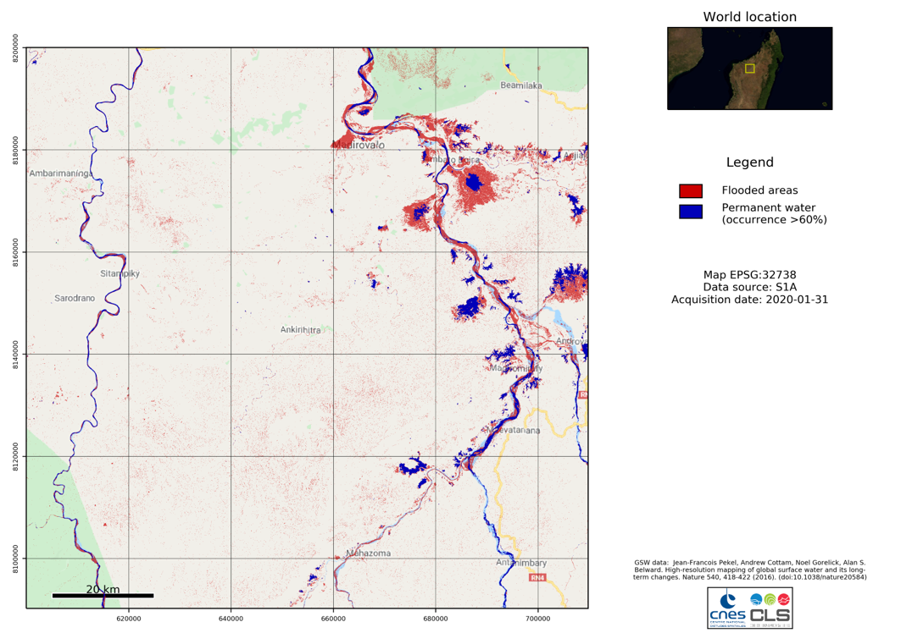

<a></a>&emsp;
<a></a>&emsp;
<a></a>&emsp;

# FloodML - Monitoring floods using Sentinel-1, Sentinel-2 and In-situ data

s project aims at detecting and monitoring floods using two approaches:

* Random Forest: Based on ScikitLearn
* Deep learning: Based on TensorFlow/Keras

<a></a>


## Getting Started

These instructions will get you a copy of the project up and running on your local machine for development, demonstration and testing purposes.

### Prerequisites

The program has dependencies on preconfigured `pip` environments, which is found in the requirements.txt.

### Installing

The python environment is managed via pip, but we recommend creating a virtual environment using `conda` first:

```
cd floodml
conda env create --name floodml
conda activate floodml
pip install -r requirements.txt
```

## Run the software

The following scripts are used for preprocessing, training and inference of both approaches.

### Satellite imagery:

* `RDF-1-preparation.py`: Prepares the data in numpy format, creates the training database.
* `RDF-2-training.py`: Runs the training algorithm
* `RDF-3-inference.py`: Runs a prediction using the trained model and an image file

There exists a second - texture-based - approach using deep learning. The scripts are structured similarly:

* `DL-1-Dataset.py`: Creates image tiles of fixed size from the mask and image pairs.
* `DL-2-Train.py`: Runs the training algorithm based on the selected network architecture
* `DL-3-Predict.py`: Runs a prediction on one or multiple tiles created during the first step
* `DL-3-Predict_L1C.py`: Runs a prediction on an entire L1C product (S1 or S2)

Please check the `notebooks` folder for a Jupyter tutorial for the whole pipeline.

## Copyright

Initial work :
* **Centre National d'Etudes Spatiales (CNES)**
* **Collecte localisation Satellites (CLS)**
* **Jet Propulsion Laboratory (JPL)**

## License

This project is licensed under the ApacheV2 License - see the [LICENSE.md](LICENSE.md) file for details
