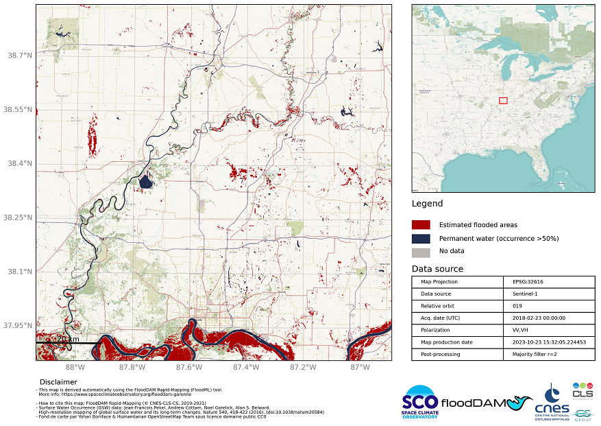

<a></a>&emsp;
<a></a>&emsp;
<a></a>&emsp;

# FloodML - Monitoring floods using Sentinel-1, Sentinel-2, Landsat 8, landsat 9 and TerraSAR-X data

This project aims at detecting and monitoring floods using a Machine Learning appraoch with Random Forest.


<a></a>


## Getting Started

These instructions will get you a copy of the project up and running on your local machine for development, demonstration and testing purposes.

### Prerequisites

The program has dependencies on preconfigured `pip` environments, which is found in the requirements.txt.

### Installing

The python environment is managed via pip, but we recommend creating a virtual environment using `conda` first:

```
cd floodml
conda create --name rapids-0.21.08 --file requirements-R02108.txt
conda activate rapids-0.21.08
```

## Run the software

The following scripts are used for preprocessing, training and inference of both approaches.

### Satellite imagery:

* `RDF-1-preparation.py`: Prepares the data in numpy format, creates the training database.
* `RDF-2-training.py`: Runs the training algorithm
* `RDF-3-inference.py`: Runs a prediction using the trained model and an image file

## Copyright

Initial work :
* **Centre National d'Etudes Spatiales (CNES)**
* **Collecte localisation Satellites (CLS)**
* **Jet Propulsion Laboratory (JPL)**

## License

This project is licensed under the ApacheV2 License - see the [LICENSE.md](LICENSE.md) file for details
